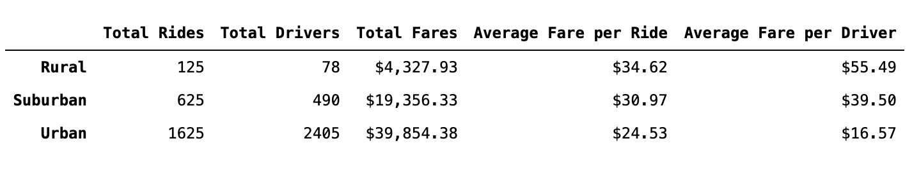
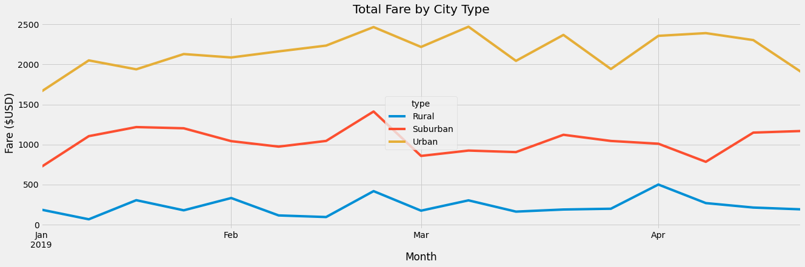

# PyBer_Analysis

## Overview
This project's purpose is creating visualizations of rideshare data for PyBer to help improve access to ride-sharing services and determine affordability for underserved neighborhoods.

This project's purpose is creating visualizations of rideshare data for PyBer to help improve access to ride-sharing services and determine affordability for underserved neighborhoods. This analysis aims to examine ride sharing specifics by city type and provide a summary of the differences and how these differences can be used to improve the service. 

## Results

Using images from the summary DataFrame and multiple-line chart, describe the differences in ride-sharing data among the different city types.

Observing the summary Dataframe we notice that the number of drivers in Urban cities far exceeds the number of total rides, which translates to significant competition which is a driving force for the prices. On the contrary there are less drivers than rides in both urban and suburban areas. We see that drivers in Rural cities make a jaw dropping $55.49 per ride while in Urban cities the amount drops to $16.57 per ride. Average fare per driver in Rural cities is 36% higher than average fare per ride. A more even distribution is observed in Suburban cities where average fare per driver is 20% higher than average fare per ride. In urban cities average fare per driver is 30% lower 

Pyber should consider dropping rates for rural and suburbav areas. Especially in rurral ares the margin between average fare per ride and average fare per driver suggests there is plenty of room for better pricing. Dropping the rate could result in an increase of rides which may counter dropping the rates. 

pyber needs to drive prices down in rural cities
