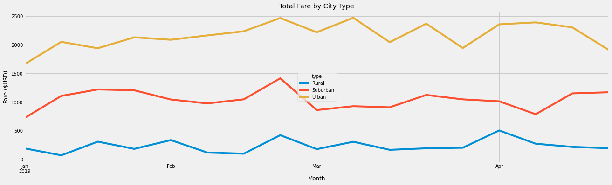

# PyBer_Analysis

## Overview

The purpose of this project is to help improve access to ride-sharing services and determine affordability for underserved neighborhoods.To achieve this we will examine ride sharing specifics by creating visualizations of rideshare data for PyBer and compare revenue shares and fares by city type.  

## Results

Observing the summary Dataframe we notice that the number of drivers in Urban cities far exceeds the number of total rides, which translates to significant competition which is a driving force for the prices. On the contrary there are less drivers than rides in both urban and suburban areas. We see that drivers in Rural cities make a jaw dropping average $55.49 per ride while in Urban cities the amount drops to $16.57 per ride. 

- Average fare per driver in Rural cities is 36% higher than average fare per ride. 
- A more even distribution is observed in Suburban cities where average fare per driver is 20% higher than average fare per ride. 
- In urban cities average fare per driver is 30% lower than fare per ride. 
- The cost of a ride in rural cities is almost 50% higher than in urban cities. 

In terms of revenue Urban cities account for 63% of the total as Suburban and Rural areas follow with 30% and 7% respectively. 

Pyber is heavily invested in urban cities where there is an abundance of drivers. One move to consider is employeeing more drivers in rural areas . More drivers would mean more competition. Demand could also be affected by cheaper rates so there is a good opportunity to achieve a new balance that will secure cheaper fares for passengers and thus more traffic. The margin between average fare per ride and average fare per driver suggests there is, indeed, room for better pricing. 

The same tactic could be applied in a smaller degree in suburban cities to bring fare per ride closer to the levels observed in urban cities.  Especially in rurral ares the margin between average fare per ride and average fare per driver suggests there is plenty of room for better pricing. 

One could also consider offering better pricing in Urban cities when traffic increases. As we see in the line chart there is a repeated peak and drop pattern from the end of February and through the end of March. Pyber can afford to make offers or discounts in rates that would flatten the revenue line but would still keep it at a very high level, even more so when compared to other types of city. 
